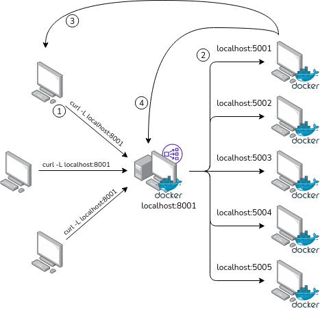

# Python & Flask load balancer from scratch

This repository contains a simple implementation of an HTTP load balancer with Python and Flask which was made as part of the project required by the *Cloud and Edge Computing* course at the University of Helsinki.

## Start the project

The commands to build the images and to run them are contained in the `init_project.sh` script.

## The HTTP server

In this implementation, the HTTP server returns the factorial of a random number to the clients that ask for it.

## The load balanceer

This is an example of the flow when a client makes a request to the load balancer and the first server
available is localhost:5001:

1. a client sends a request to the load balancer;
2. the load balancer redirects the client to one of the available servers in the pool;
3. the server returns the result of the factorial to the client;
4. the server sends a request to the load balancer, advertising that it finished the previous job and is available to serve another client.



When a request arrives to the load balancer, it will get the first available server from that list and
redirect the client to said server. 
This is done by the `next_available_server()` method, which returns the port
of the available server. 

If there are no ports available, thus the list is empty, the load balancer will wait
until another one becomes available.
Factorial servers send requests to the load balancer via localhost:8001/port update/[PORT NUMBER],
which trigger the `update_port()` method. This will append the port number arrived in the request to
port list.

I have implemented it in such way since I belive that this performs better than the classic [Round Robin](https://en.wikipedia.org/wiki/Round-robin_scheduling) implementation.


The list of available ports is not hardcoded, it is contained in the `servers.json` file, which is created during the `./init_project.sh` script via the command:

```bash
    echo '{" available _servers ": ["5001" , "5002" , "5003" , "5004" , "5005"]}' > load_balancer/app/servers.json
```